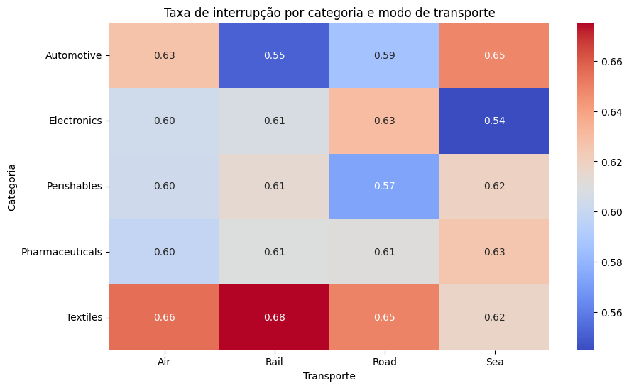
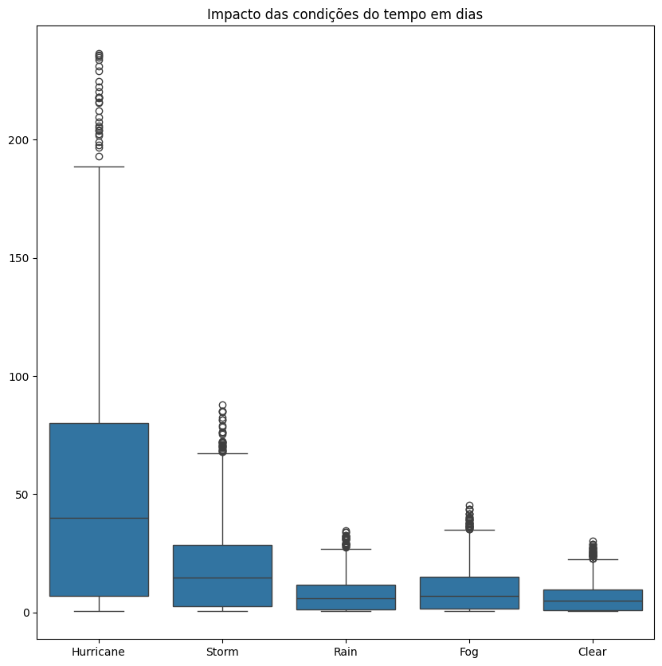
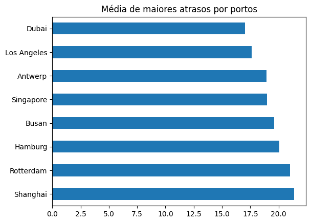

# Análise de Risco na Cadeia Global de Suprimentos

A cadeia global de suprimentos está sujeita a diversos fatores de risco que podem impactar prazos de entrega, interrupções logísticas e eficiência operacional.

Este projeto realiza uma Análise Exploratória de Dados (EDA) para investigar como diferentes variáveis — como condições climáticas, rotas logísticas, portos, modos de transporte e categorias de produtos — influenciam atrasos e riscos na cadeia de suprimentos.

## Estrutura da Análise - Projeto

Dataset de operações logísticas globais entre 2024-2026.

# 1️⃣ Interrupções na Cadeia de Suprimentos

## 1.1 - Como a taxa de interrupção varia por categoria de produto e modo de transporte?

O heatmap mostra como a taxa de interrupção varia entre diferentes categorias de produtos e modos de transporte.

A análise da taxa de interrupção por categoria de produto e modo de transporte indica que Textiles transportado por Rail apresenta a maior taxa de interrupção (0.68), sugerindo que essa combinação é a mais vulnerável da cadeia logística e demanda maior atenção operacional.

Por outro lado, algumas combinações apresentam maior estabilidade, como Electronics transportado por Sea (0.54) e Automotive por Rail (0.55), que registraram menores taxas de interrupção, indicando operações logísticas relativamente mais confiáveis.

# 2️⃣ Impacto das Condições Climáticas
## 2.1 - Como diferentes condições climáticas afetam o prazo de entrega?

O boxplot mostra a distribuição do dos prazos em dias para diferentes condições climáticas. Observa-se que **furacões (Hurricane)** apresentam o maior impacto no tempo de entrega, com maior mediana e grande variabilidade, além de diversos outliers indicando atrasos extremos.

Tempestades (Storm) também aumentam o prazo, porém em menor magnitude. Já condições como **Rain, Fog e Clear** apresentam valores medianos mais baixos e menor dispersão.

Esses resultados indicam que **eventos climáticos extremos, especialmente furacões, são os principais responsáveis por grandes atrasos na cadeia de suprimentos**.

# 3️⃣ Rotas com Maior Prazo de Entrega
## 3.1 - Quais rotas apresentam maior prazo médio de entrega?

.png)

Observa-se que muitas das rotas com maior prazo médio envolvem conexões entre portos europeus (Rotterdam, Hamburg, Antwerp) e asiáticos (Busan, Shanghai, Singapore). 

Isso sugere que rotas intercontinentais tendem a apresentar maiores prazos médios, possivelmente devido a maiores distâncias marítimas, maior complexidade logística e maior probabilidade de atrasos portuários.

# 4️⃣ Portos Associados a Maiores Atrasos
## 4.1 - Quais portos estão associados aos maiores prazos médios?

A análise dos prazos médios por porto mostra que alguns portos estão associados a prazos de entrega mais elevados. Portos como **Shanghai, Rotterdam e Hamburg** apresentam os maiores tempos médios, o que pode indicar rotas mais longas, maior volume de carga ou maior complexidade logística nessas regiões.

Por outro lado, portos como **Dubai e Los Angeles** apresentam prazos médios menores em comparação com os demais, sugerindo operações logísticas potencialmente mais eficientes ou rotas mais curtas.

De forma geral, os resultados indicam que o desempenho logístico pode variar significativamente entre portos, possivelmente devido a fatores como distância das rotas, congestionamento portuário e infraestrutura logística.

# Conclusões

A análise revelou que o desempenho da cadeia de suprimentos é influenciado por múltiplos fatores:

Eventos climáticos extremos aumentam significativamente os prazos de entrega.

Rotas intercontinentais tendem a apresentar maiores prazos.

Alguns portos aparecem associados a maiores atrasos logísticos.

Esses resultados mostram que a gestão eficiente da cadeia de suprimentos depende de compreender fatores ambientais, estruturais e operacionais que impactam o fluxo logístico global.